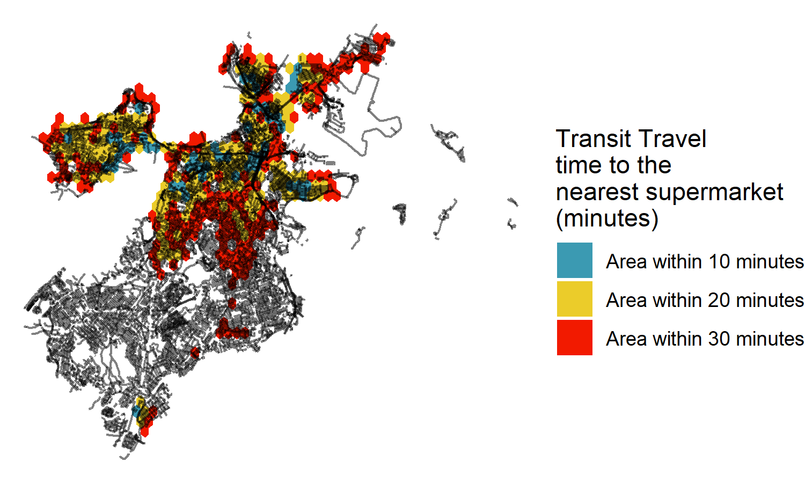
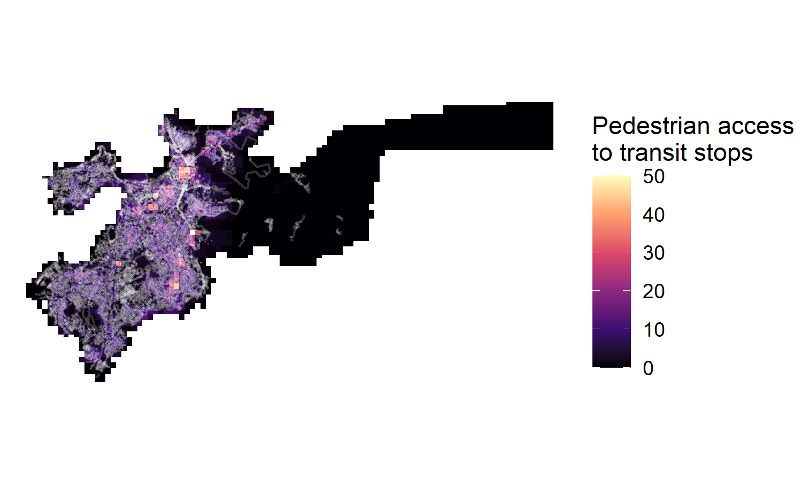
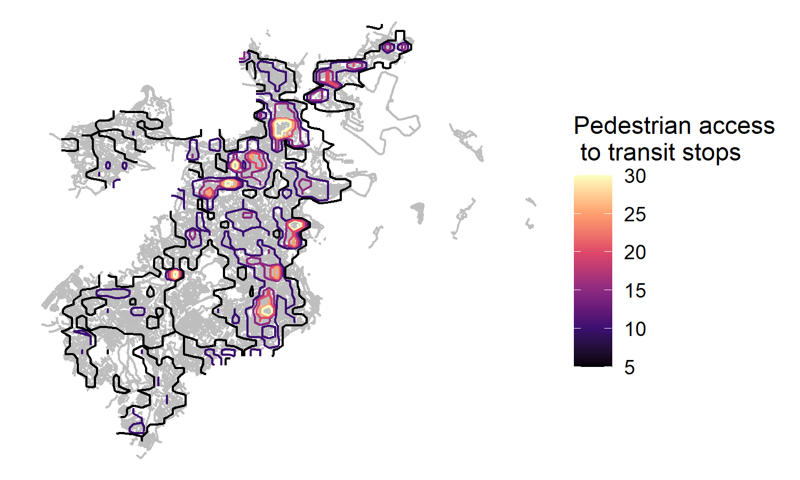
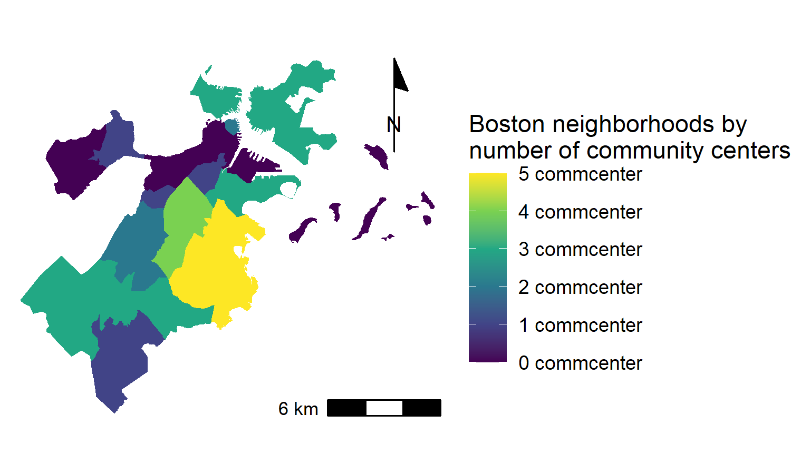
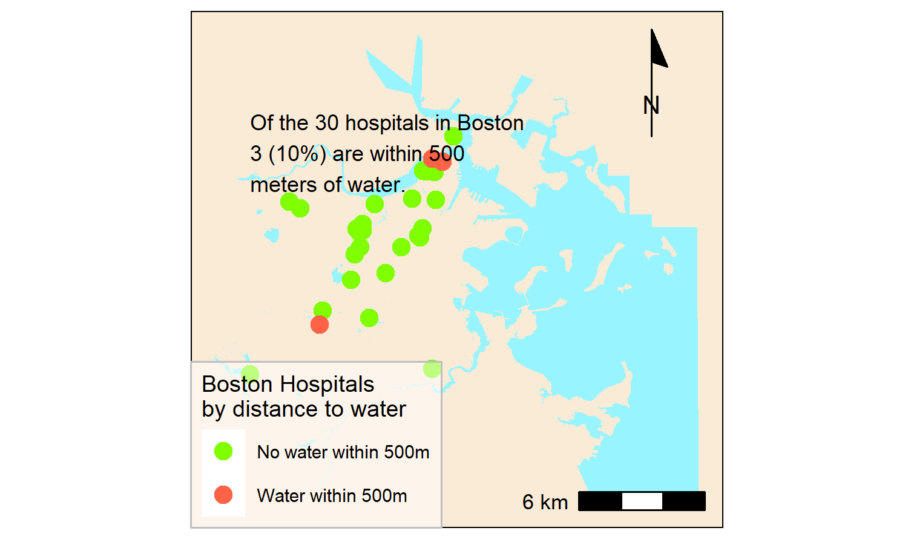

```{r setup, include=FALSE}
knitr::opts_chunk$set(echo = TRUE)
```

# Introduction

The following maps demonstrate skills developed during Spatial Analysis, Fall 2021. They range in content and geography, though each tells a story about difference across space. 


# Brooklyn

## Interactive Map: Libraries and Whiteness

Brooklyn Public Library, in its ideal sense, is a democratic system of knowledge production and preservation. But how equitably are its branches distributed? Layering in census demographic information - white population in this case - shows us which people the libraries serve. From preliminary visual analysis, we see stark segregation, with Flatbush Avenue a dividing line between white populations and populations of color. The libraries, however, appear rather evenly distributed across the geography. 

*Skills demonstrated: Displaying data on an interactive map; Displaying multiple vector layers on the same map*

[](https://jebp.github.io/portfolio/fullsize/WhitenessAndLibraries.html){target="_blank"}


# Seoul

## Georeferenced Seoul, 1946-2021
Combining georeferenced historical maps with contemporary geospatial data narrates change over time. In this map, Seoul's building footprints show the extent and density of urban development. The built form has expanded dramatically since 1946, covering areas that were once forested. This development had implications for the river as well, whose footprint has changed with dredging and the overall conversion of ambiguous sandbar to either land or water.

*Skills demonstrated: Georeferencing a raster image; Displaying multiple vector layers on the same map*

[](https://jebp.github.io/portfolio/fullsize/SeoulMapFInal.pdf){target="_blank"}


# Boston
Given Harvard's location and my desire to explore locally relevant datasets, the remaining maps focus on Boston. 

## Isochrone Map: Supermarket Access
This isochrone map shows transit travel time to the nearest supermarket, limited to areas within 30 minutes. (Note that the data appear incomplete - some markets seem to be missing in central and southern Boston - which is a reminder of OpenStreetMap's limitations.) Nonetheless, the general pattern of strong food access in the denser parts of the city makes sense, and suggests that downtown is a food haven, while other areas may be closer to food deserts.

*Skills demonstrated: Calculating and displaying accessibility, based on travel time*

[](https://jebp.github.io/portfolio/fullsize/TransitToMarket.pdf){target="_blank"}

## Accessibility Raster: Pedestrian Access to Transit
Access to mobility is key to full participation in urban life. For many people, that means walking to a transit stop. This map assigns accessibility scores across Boston, using a distance-decay function of walking time to the closest transit stop. 

*Skills demonstrated: Calculating and displaying accessibility, based on travel time; Displaying raster data on a map*

[](https://jebp.github.io/portfolio/fullsize/Ped_Transit_Access.pdf){target="_blank"}

## Accessibility Contours: Pedestrian Access to Transit
This map uses the same data as the one above, but converts the raster data into contour vectors. 

*Skills demonstrated: Calculating and displaying accessibility, based on travel time; Converting between raster layers and vector layers* 

[](https://jebp.github.io/portfolio/fullsize/Ped_Contours.pdf){target="_blank"}

## Point to Polygon Aggregation: Community Centers by Neighborhood
While the three previous maps showed where Bostonians might purchase food and take transit, this one shows where they (especially youth) can hang out, find services, and play. Aggregating community center points to neighborhood polygons shows that Dorchester has the most community centers of any neighborhood, which makes sense given its large size. 

*Skills demonstrated: Aggregating point data to a layer of polygons; Displaying multiple vector layers on the same map*

[](https://jebp.github.io/portfolio/fullsize/CommCenter_Neighborhood.pdf){target="_blank"}

## Distance Relationships: Hospitals by the Water
Boston is known for its health institutions and waterways. How might the two be related? This map uses a polygon buffer to analyze which hospitals are within half a kilometer to from water, with potential implications being the treatment of boating injuries, the healing power of pleasant views, and the threat of flooding. 

*Skills demonstrated: Calculating and displaying relationships among point and polygon layers based on distance; Displaying multiple vector layers on the same map*

[](https://jebp.github.io/portfolio/fullsize/Hospitals_Water.pdf){target="_blank"}
